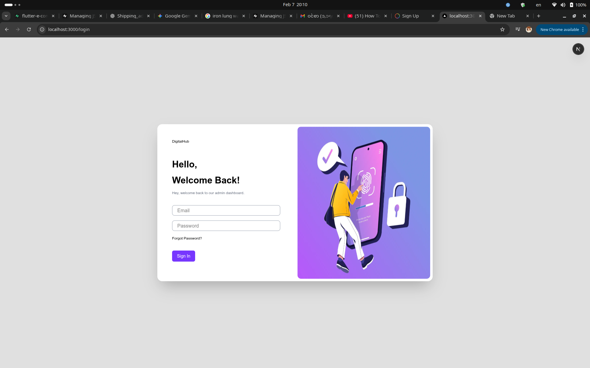
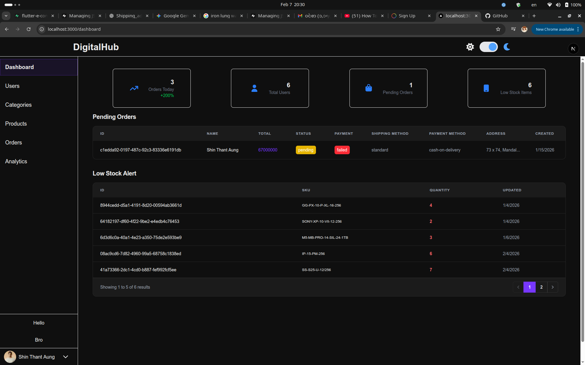
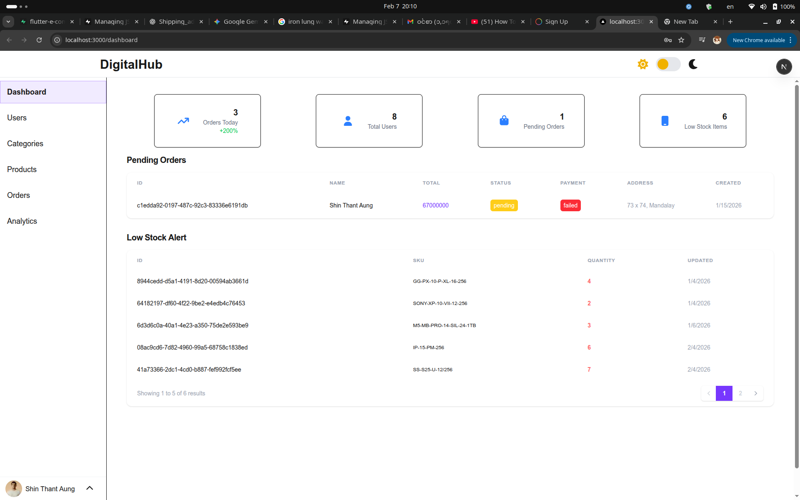

This is a [Next.js](https://nextjs.org) project bootstrapped with [`create-next-app`](https://nextjs.org/docs/app/api-reference/cli/create-next-app).

## Getting Started

First, run the development server:

```bash
npm run dev
# or
yarn dev
# or
pnpm dev
# or
bun dev
```

Open [http://localhost:3000](http://localhost:3000) with your browser to see the result.

You can start editing the page by modifying `app/page.tsx`. The page auto-updates as you edit the file.

This project uses [`next/font`](https://nextjs.org/docs/app/building-your-application/optimizing/fonts) to automatically optimize and load [Geist](https://vercel.com/font), a new font family for Vercel.

## About This Project

- This Project is for the admins of DigitalHub E-commerce app I created using flutter.
- It will contain the following features:
    - Light & Dark Theme
    - Login/Logout
    - Charts for Analysis of Sales and Users
    - A Default Dashboard Page for quick accessing critical sales information
    - A page for managing DigitalHub's company staffs(user management)
    - A page for managing Products
    - A page for managing Categories
    - A page for managing Orders
- All sub-functions (CRUD) will be done in that same specific pages via popup modals or updating directly via tables.

## Main Dashboard Page

- Here, you will find 4 cards and 2 tables. 
- The 4 cards indicate each aspects of DigitalHub.
- One card tells today's orders and compare it with yesterday's total orders and tell you the growth or down percentage. 
- One card tells you total users registered in the app(not including staffs and admins).
- One card tells you how many items are low on stock. The show you the number of items that has quantity lower than 10.
- One card tells you how many orders are pending. 
- The 2 tables show you Low Stock Items and Pending Orders.
- Each Table has their own pagination.

    ## Sample Photos

    
    
    


## User Page

- Coming Soon

## Category Page

- Coming Soon

## Product Page

- Coming Soon

## Order page

- Coming Soon

## Analytics Page

- Coming Soon

## Learn More

To learn more about Next.js, take a look at the following resources:

- [Next.js Documentation](https://nextjs.org/docs) - learn about Next.js features and API.
- [Learn Next.js](https://nextjs.org/learn) - an interactive Next.js tutorial.

You can check out [the Next.js GitHub repository](https://github.com/vercel/next.js) - your feedback and contributions are welcome!

## Deploy on Vercel

The easiest way to deploy your Next.js app is to use the [Vercel Platform](https://vercel.com/new?utm_medium=default-template&filter=next.js&utm_source=create-next-app&utm_campaign=create-next-app-readme) from the creators of Next.js.

Check out our [Next.js deployment documentation](https://nextjs.org/docs/app/building-your-application/deploying) for more details.
