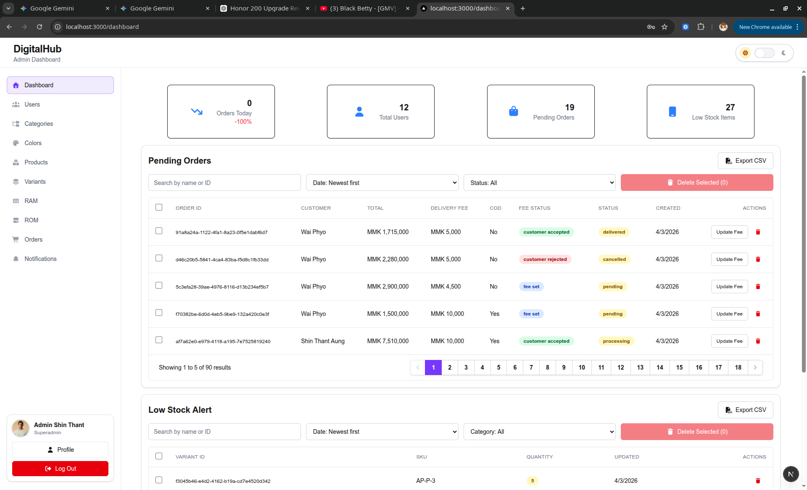
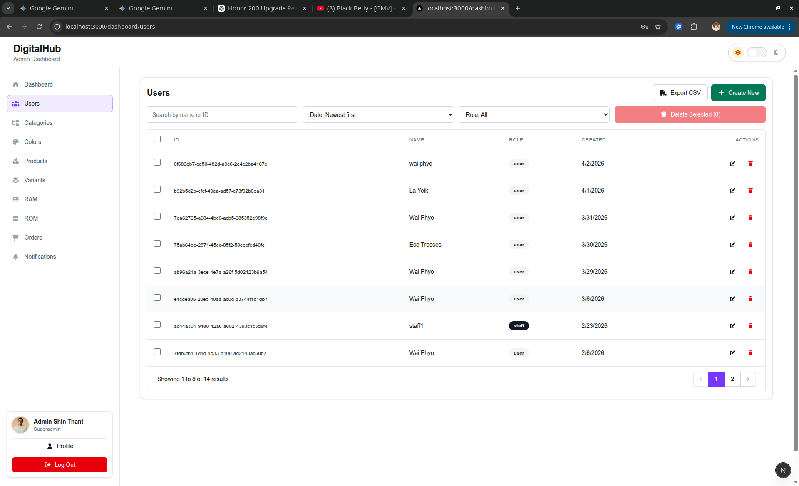
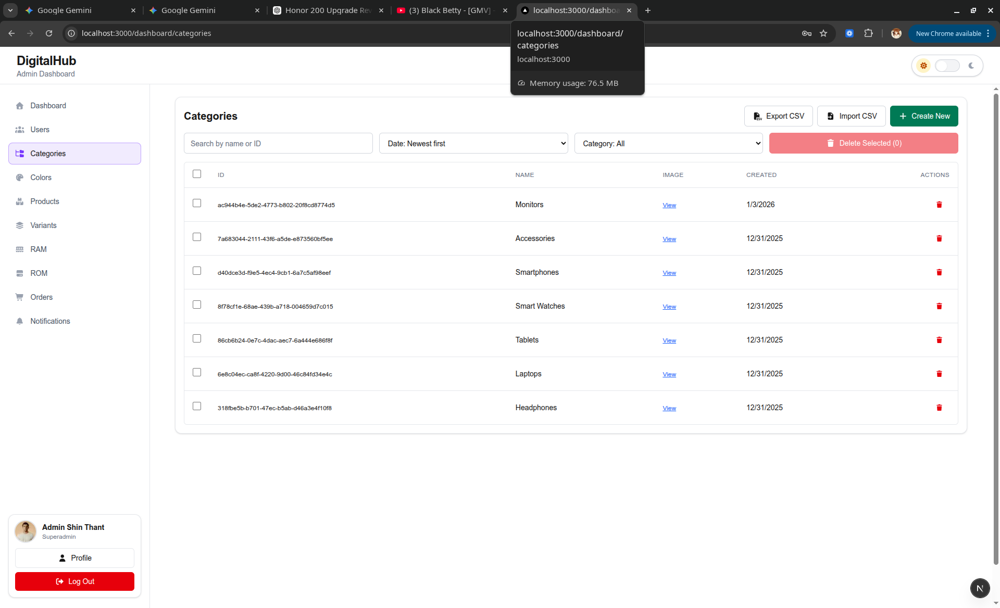
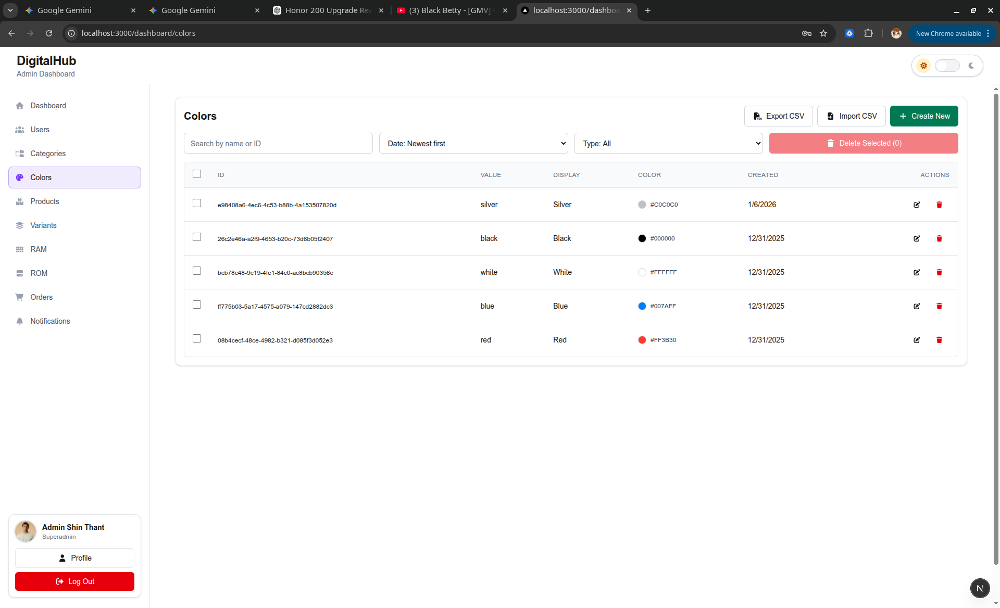
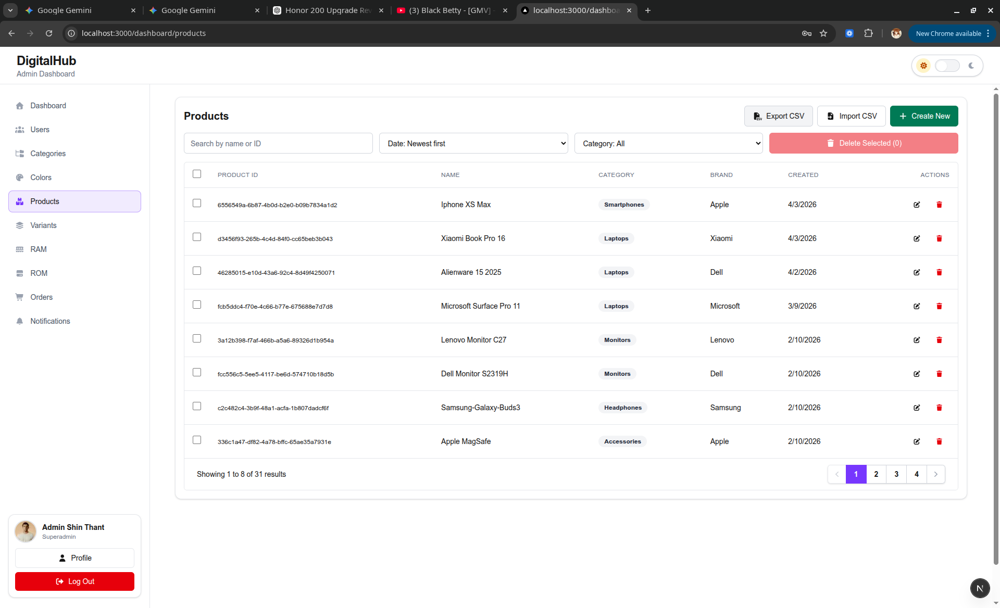
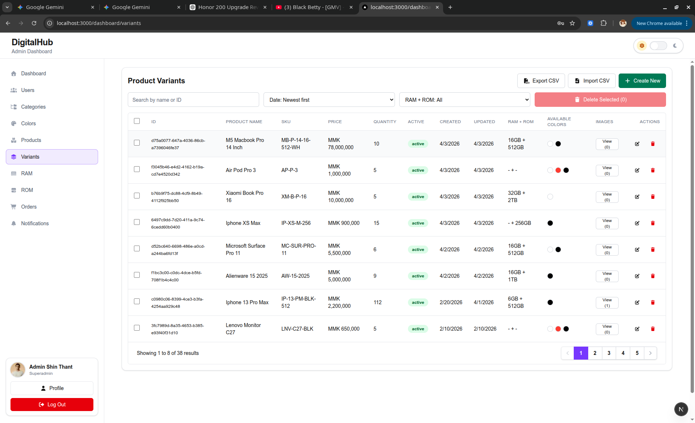
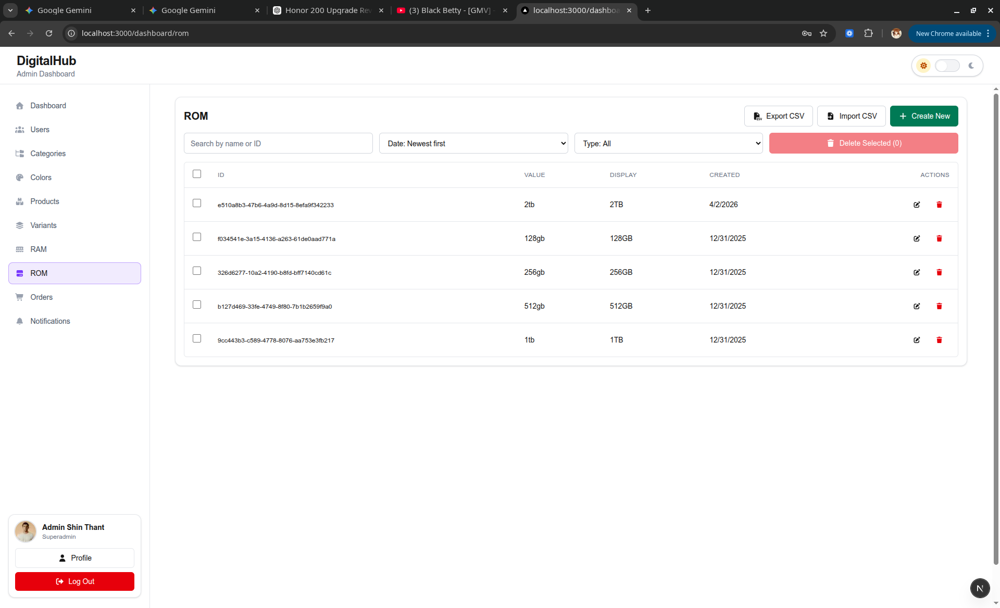
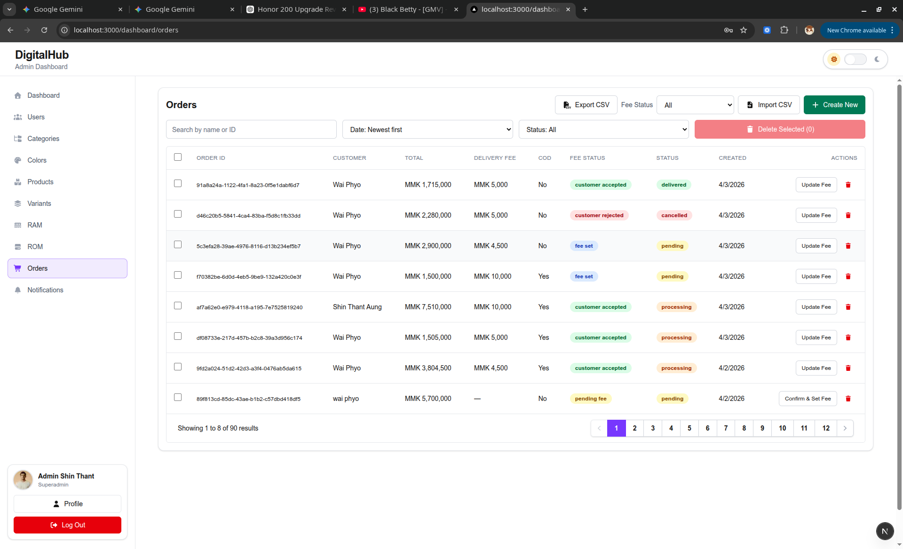
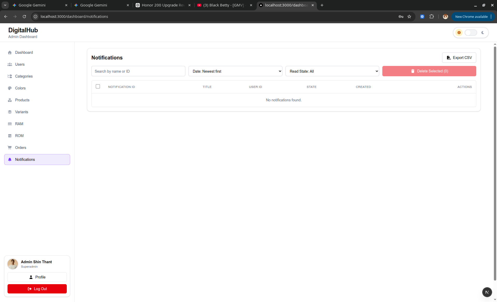
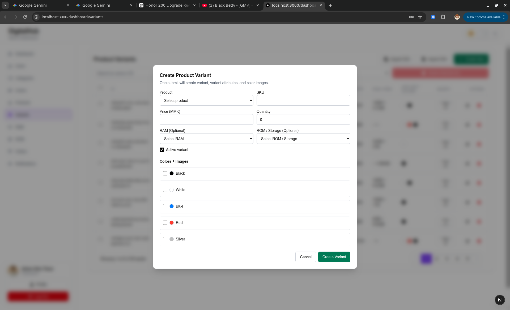

**Summary**
DigitalHub Admin Dashboard is a Next.js admin panel for managing an e-commerce catalog, orders, users, and product variants. The flow is: a user hits `/`, is redirected to `/login`, signs in via Supabase email/password, then middleware checks the session and role before allowing `/dashboard/*`; unauthorized roles are sent to `/not-allowed`.

**Main Dashboard**
The landing admin view shows KPI cards (orders today, total users, pending orders, low-stock count) plus two operational tables: Pending Orders and Low Stock Alerts. The pending orders table includes a fee confirmation action, while low stock highlights low-quantity variants.


**Users Table**
User management uses the `profiles` table and shows ID, name, role, and created date. Admins can edit staff users; superadmins can create staff/admin accounts and delete rows they are allowed to manage.


**Categories Table**
Categories list ID, name, image link, and created date. The page supports creating a new category with name and optional image URL, CSV import, and bulk delete.


**Colors Table**
Colors are attribute values tied to an attribute type that matches "color". The table shows ID, value, display value, color preview, and created date, with create/edit/delete and CSV import support.


**Products Table**
Products show ID, name, category, brand, and created date. You can create products with category/brand, description, and images (external URLs or local uploads), update details, and import via CSV.


**Variants Table**
Variants list ID, product name, SKU, price, quantity, active state, created/updated dates, RAM+ROM group, available colors, and an image viewer. Create/edit flows handle RAM/ROM, color mapping, and color-specific images.


**RAM Table**
RAM values are stored as attribute values and managed with create/edit/delete, plus CSV import. The table includes ID, value, display value, and created date.


**ROM Table**
ROM/Storage values are managed similarly to RAM. The table includes ID, value, display value, and created date.


**Orders Table**
Orders show ID, customer, totals, delivery fee, COD allowed, fee status, overall status, and created date. Admins can filter by fee status, create orders, confirm delivery fees, import CSV, and delete rows.


**Notifications Table**
Notifications show ID, title, user ID, sent/queued state, read/unread state, and created date, with bulk deletion support.


**Create Modal**
Create and update actions use a consistent modal layout with form controls and action buttons. This sample image represents the shared modal style used across tables.


**Key Features**
- CRUD workflows for users, products, categories, orders, notifications, and variants.
- CSV import/export on data tables.
- Role-aware actions and protected routes.
- Theme toggle with persisted preference.
- Product image uploads to Supabase Storage.

**Tech Stack**
- Next.js App Router (`next` 16) with React 19 and TypeScript.
- Tailwind CSS and reusable UI components.
- Supabase for auth, database, and storage.
- Zustand for theme state.
- Font Awesome icons.

**Routing**
- `/` redirects to `/login`.
- `/login` handles Supabase email/password sign-in.
- `/dashboard` shows the KPI cards and operational tables.
- `/dashboard/users`, `/dashboard/categories`, `/dashboard/colors`, `/dashboard/products`, `/dashboard/variants`, `/dashboard/ram`, `/dashboard/rom`, `/dashboard/orders`, `/dashboard/notifications`.
- `/dashboard/profile` for profile updates and password change.
- `/not-allowed` for role-blocked access.

**Navigation**
The dashboard layout (`app/dashboard/layout.tsx`) provides a navbar with theme toggle and a sidebar with all admin sections. The sidebar also surfaces the current profile and logout action.

**Authentication**
Login uses `client.auth.signInWithPassword` from Supabase. Session state is validated in `middleware.ts` for all `/dashboard/*` routes.

**Roles & Permissions**
Roles live in the `profiles` table. Allowed dashboard roles are `staff`, `admin`, and `superadmin`. Admins can manage staff, while superadmins can create and manage admin/staff accounts.

**Supabase Tables**
- `profiles` for user metadata and roles.
- `categories` for product taxonomy.
- `brands` used by products.
- `products` for core product records.
- `product_images` for product and color-specific images.
- `product_variants` for SKU-level inventory.
- `attribute_types` and `attribute_values` for RAM/ROM/Color catalogs.
- `variant_attributes` to link variants and attributes.
- `orders` for purchase records.
- `notifications` for user messages.

**Attribute System**
The Colors, RAM, and ROM pages are powered by attribute types and values. Attribute types are matched by name/display name and filter values accordingly.

**Orders Workflow**
Orders include fee status tracking (`pending_fee`, `fee_set`, `customer_accepted`, `customer_rejected`) and support a confirm/update fee modal with COD toggles.

**Inventory Workflow**
Low stock alerts are derived from `product_variants` quantity levels. The dashboard highlights critical stock and allows bulk cleanup of low-stock variants.

**Product Images**
Product images can be attached via external URLs or uploaded files. Uploads go to the `product-images` Supabase storage bucket with a 10MB limit and require `NEXT_SECRET_KEY` for server-side access.

**CSV Import**
- Categories: required `name`, optional `image_url`.
- Colors/RAM/ROM: required `value`, optional `display_value`, optional `color_hex` for colors.
- Products: required `name`, `category`, `brand`; optional `description`, `is_archived`.
- Variants: required `product`, `sku`, `price`, `quantity`, `is_active`; optional `ram`, `rom`, `colors`, `image_urls`.
- Orders: required `total_amount`, `status`, `payment_status`; optional `user_id`, `user_name`, `customer_name`, `transaction_id`, `street`, `city`, `payment_method`, `shipping_method`.

**CSV Export**
Every table can export the current filtered view to CSV using the "Export CSV" action in the table toolbar.

**Data Table UX**
Tables support search by ID/name, sorting, category filters, pagination, row actions, and bulk delete with a confirmation modal.

**State Management**
Local UI state is handled with React hooks. Theme state is stored in Zustand and persisted in `localStorage`.

**Styling**
Tailwind CSS drives layout, spacing, and theming. Shared UI primitives live under `app/components/ui` for consistent buttons, badges, inputs, and tables.

**Environment Variables**
Create `.env.local` with these keys:
- `NEXT_PUBLIC_SUPABASE_URL`
- `NEXT_PUBLIC_SUPABASE_PUBLISHABLE_KEY`
- `NEXT_SECRET_KEY`

**Local Development**
```bash
npm install
npm run dev
```
App runs at `http://localhost:3000`.

**Build & Deployment**
```bash
npm run build
npm run start
```
The build script uses webpack (`next build --webpack`) for production builds.

**Troubleshooting**
- If login fails, verify Supabase URL and publishable key.
- If uploads fail, confirm `NEXT_SECRET_KEY` and `product-images` bucket exist.
- If you see `/not-allowed`, verify the user role in `profiles`.
